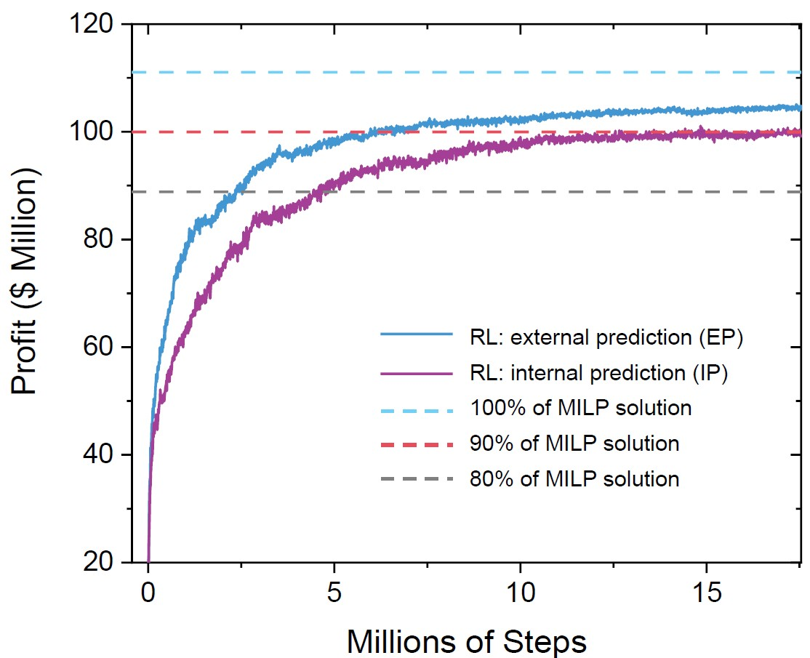
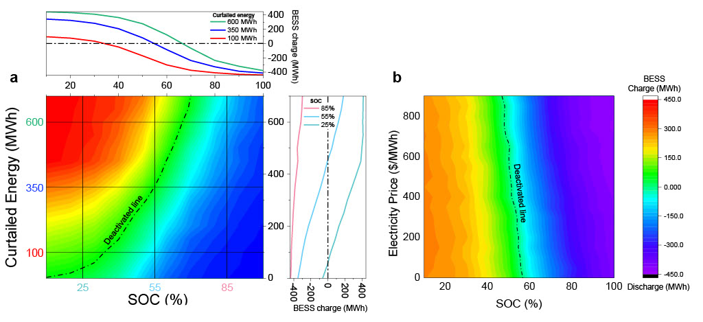
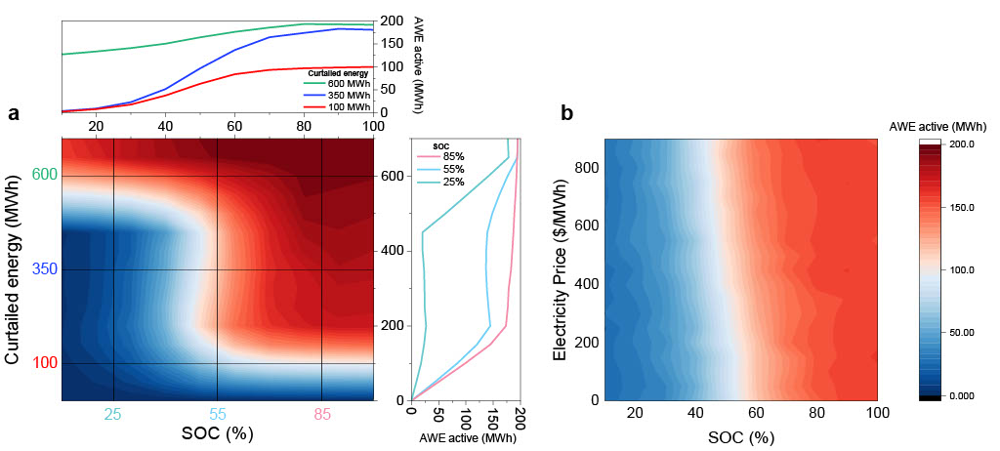

<div style="display:flex; align-items: center;">

# Optimal Planning of Hybrid Energy Storage Systems using Curtailed Renewable Energy through Deep Reinforcement Learning

</div>

-----------------------------

## Abstract

Energy management systems are becoming increasingly important in order to utilize the continuously growing curtailed
renewable energy. Promising energy storage systems, such as batteries and green hydrogen should be employed to maximize
the efficiency of energy stakeholders. However, optimal decision-making, i.e., planning the leveraging between different
strategies, is confronted with the complexity and uncertainties of large-scale problems. A sophisticated deep
reinforcement learning methodology with a policy-based algorithm is proposed here to achieve real-time optimal energy
storage systems planning under the curtailed renewable energy uncertainty. A quantitative performance comparison proved
that the deep reinforcement learning agent outperforms the scenario-based stochastic optimization algorithm, even with a
wide action and observation space. A robust performance, with maximizing net profit and stable system, was confirmed to
the uncertainty rejection capability of the deep reinforcement learning under a large uncertainty of the curtailed
renewable energy. Action-mapping was performed for visually assessing the action taken by the deep reinforcement
learning agent according to the state. The corresponding results confirmed that the deep reinforcement learning agent
learns the way as the deterministic solution performs, and demonstrates more than 90\% profit accuracy compared to the
solution.

-------------------------------

## setup

```
setup(
    name="EMSRL",
    version="1.0",
    url="https://github.com/kangdj6358/EMSRL",
    author="Dongju Kang, Doeun Kang",
    license="MIT",
    install_requires=[
        "gym == 0.18.3",
        "ray == 1.9.0",
        "ray[rllib] == 1.9.0",
        "pandas == 1.3.3",
        "openpyxl == 3.0.9",
        "torch == 1.9.1",
    ],
    zip_safe=False,
)
```

-------------------------

## Results

### Training profit of PPO and MILP optimal value



### Action mapping of the BESS



### Action mapping of the AWE



-----------------------

## Code
